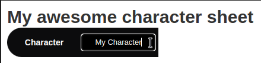
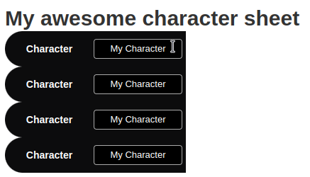
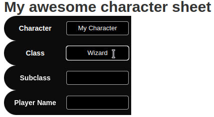

# Svelte20

This template repository allows the creation of [custom roll20 sheets](https://wiki.roll20.net/Building_Character_Sheets) using the [Svelte](https://svelte.dev/) frontend framework

## Advantages

Svelte is very easy to use, if you know HTML/CSS/JS, you can get started with Svelte right away.

In addition, it is very easy to integrate with multiple languages, such as TypeScript, PUG, Sass, Less, CoffeeScript, etc. In particular, this template is pre-configured to work with TypeScript, Sass/Scss and PUG out of the box. Using these languages is, of course, optional, and you can keep using regular HTML/CSS/JS if you prefer.

Svelte also allows you to break up your code into multiple files, avoiding the monolithic HTML and CSS files that usually result from working without a framework.

Another Svelte feature that is personally one of my favorites, is component-scoped styles, that is, if you add a `style` tag to your markup and inside it use a selector that targets all `div` elements, only the `div`s defined inside that same file will be affected, rather than all `div`s globally.

This project also includes [Webpack](https://webpack.js.org/), which in this case allows the usage of `import` syntax inside sheet workers, removing the need to keep all your code in a single file and making it easier to use external libraries such as [The Aaron Sheet](https://github.com/shdwjk/TheAaronSheet).

## Getting started

In order to use this template, you will need to have [Node.js](https://nodejs.org) installed on your computer.

- Start by downloading this template, either by cloning it with `git` or downloading it using the `code` button above.
- Open a terminal in the root directory of the template and run `npm install` to download all the dependencies.
- Open the file `src/sheet/sheet.svelte` and edit it to your liking. You can use standard HTML/CSS.
- In the terminal, run `npm run build`. This will create a directory named `build` and put all the sheet's files inside it (`sheet.html`, `sheet.css`, `sheet.json`, `README.md`, etc.)
- You can run `npm run build:watch` in order to build the sheet automatically every time you make changes to any of the files.
- You could also run `npm run dev` in order to test your sheet in a browser and reload changes automatically. However, any roll20 specific features won't work this way.

## Usage

### HTML
You can write regular HTML inside `.svelte` files, for instance, you could replace the contents of `sheet.svelte` with the following
```html
<h1>My awesome character sheet</h1>
<input type="text" name="attr_character_name">
<button type="roll" value="/roll 1d20">Roll d20</button>
```

This would create exactly what you would expect: a sheet with big letters that read "My awesome character sheet", followed by a text input that is linked to the "character_name" attribute and a "Roll d20" button that rolls `1d20` when clicked. Great!

Keep in mind, however, that the `{` and `}` characters have special meaning in Svelte, so if we wanted our button to roll `1d20 + strength modifier`, we would need to write it like so

```
<button type="action" value={"/roll 1d20+@{strength_mod}"}>Roll d20</button>
```
But let's say you're not so fond of HTML, let's say you prefer [PUG](https://pugjs.org/api/getting-started.html). Well, you could replace the previous code with

```pug

<template lang="pug">
    h1 My awesome character sheet
    input(type="text" name="attr_character_name")
    button(type="roll" value="/roll 1d20") Roll d20
</template>
```
And voilà, your code will be automatically converted to html after running `npm run build`

### CSS

Let's say you have the following code

```html
<h1>My awesome character sheet</h1>
```
But it's too boring, you want the text to be red!
Well, doing that is as simple as adding the following code to your file


```html
<h1>My awesome character sheet</h1>

<style>
    h1 {
        color: red;
    }
</style>
```
After running `npm run build` your styles will be moved into a separate `sheet.css` file

If you preferred, you could use `scss` or `sass` syntax, like so

```html
<h1>My awesome character sheet</h1>

<style lang="sass">
    h1 
        color: red
</style>
```

But you're not limited to those languages, while this project only includes vanilla css and scss/sass by default, you could, for instance, run `npm install --save-dev less` and start using `less` in your Svelte files. For more information, take a look at [svelte-preprocess](https://github.com/sveltejs/svelte-preprocess).

### JS (Sheet Workers)

Let's say you have a button that looks like this
```html
<button type="action" name="act_hello_world">Hello World</button>
```
and you want to print "Hello World!" to the console whenever the button is clicked, well, you need a sheet worker for that, let's add the following to our file

```html
<script context="module" sheetworker>
    on("click:hello_world" () => {
        let message = "Hello World"
        console.log(message)
    })
</script>

<button type="action" name="act_hello_world">Hello World</button>
```

Note the `sheetworker` attribute in the script tag.

If you'd rather use TypeScript syntax, you can do so by adding a `lang="ts"` attribute to the script tag

```html
<script context="module" lang="ts" sheetworker>
    on("click:hello_world" () => {
        let message: string = "Hello World"
        console.log(message)
    })
</script>

<button type="action" name="act_hello_world">Hello World</button>
```

That's nice and all, but the message looks a bit bland, let's say we want to use the logging functions included with [The Aaron Sheet](https://github.com/shdwjk/TheAaronSheet), normally, you would need to copy and paste the *entire* contents of The Aaron Sheet at the beginning of your code. Not here!

Let's download the file `TheAaronSheet.js` and place it next to our `sheet.svelte`. Next, we can add an `import` statement to the beginning of our sheet worker and replace our `console.log` with `TAS.log`

```html
<script context="module" lang="ts" sheetworker>
    import "./TheAaronSheet"
    on("click:hello_world" () => {
        let message: string = "Hello World"
        TAS.log(message)
    })
</script>

<button type="action" name="act_hello_world">Hello World</button>
```

The code will automatically be bundled together inside `build/sheet.html` after running `npm run build`

### Tabs

This project includes a small library that makes it very simple to add tabs to a character sheet

```HTML
<script context="module" sheetworker>
	//Tabs won't work inside roll20 without this import
	import '../lib/Tabs/TabsWorker';
</script>

<script>
	//This import cannot be inside the sheet worker
	import { Tab, TabButton, TabView } from '../lib/Tabs';
</script>

<TabView>
	<!-- This will create 3 tabs, named Tab 1, Tab 2 and Tab 3 -->
	<TabButton>Tab 1</TabButton>
	<TabButton>Tab 2</TabButton>
	<TabButton>Tab 3</TabButton>

	<Tab>
		<h1>Content for the first tab goes here</h1>
	</Tab>
	<Tab>
		<h1>Content for the second tab goes here</h1>
	</Tab>
	<Tab>
		<h1>Content for the third tab goes here</h1>
	</Tab>
</TabView>
```
Note that you need to import `lib/Tabs/TabsWorker` inside your sheet worker for the tabs to actually work.
Also keep in mind that the import statement for the tabs themselves must be inside a regular script, not a sheet worker.

### Encapsulation
Even in a simple project, the size of the HTML will quickly spiral out of control. Thankfully, Svelte allows us to break up our code into multiple files.

Say we have the following code inside our `sheet.svelte`

```HTML
<!-- sheet.svelte -->
<h1>My awesome character sheet</h1>


<input type="text" name="attr_character_name" />

<div class="labeled-input">
	<h4>Class</h4>
	<input type="text" name="attr_class" />
</div>

<style>
	.labeled-input {
		height: 50px;
		width: 250px;
		background-color: #0c0c0d;
		border-top-left-radius: 50px;
		border-bottom-left-radius: 50px;
		color: white;
		display: grid;
		grid-template-columns: repeat(2, 1fr);
		grid-template-rows: 1fr;
		align-items: center;
		text-align: center;
		padding-right: 5px;
	}

	h4 {
		margin: 0;
		color: white;
	}
</style>
```
The resulting sheet would look something like this



Say we wanted to have multiple inputs that look the same, like an input for a class, subclass, level, player name, etc. If we were using regular HTML, we would have to copy-paste our code multiple times. Instead, let's create a new file named `LabeledInput.svelte` and move our code there


```HTML
<!-- LabeledInput.svelte -->
<div class="labeled-input">
	<h4>Class</h4>
	<input type="text" name="attr_class" />
</div>

<style>
	.labeled-input {
		height: 50px;
		width: 250px;
		background-color: #0c0c0d;
		border-top-left-radius: 50px;
		border-bottom-left-radius: 50px;
		color: white;
		display: grid;
		grid-template-columns: repeat(2, 1fr);
		grid-template-rows: 1fr;
		align-items: center;
		text-align: center;
		padding-right: 5px;
	}

	h4 {
		margin: 0;
		color: white;
	}
</style>
```

Now, we need to import this component inside our main `sheet.svelte` file, like this

```HTML
<!-- sheet.svelte -->
<script>
	import LabeledInput from './LabeledInput.svelte';
</script>

<h1>My awesome character sheet</h1>

<LabeledInput />

```
Note that this script tag doesn't have a `sheetworker` or a `context="module"` attribute

Now, we can have many labeled inputs by doing this

```HTML
<!-- sheet.svelte -->
<script>
	import LabeledInput from './LabeledInput.svelte';
</script>

<h1>My awesome character sheet</h1>

<LabeledInput />
<LabeledInput />
<LabeledInput />
<LabeledInput />

```

But there's a glaring problem: they all look the same



So, let's add some attributes to our `LabeledInput` component. To do that, we add a `script` tag to our component and export variables with the names of our attributes


```HTML
<!-- LabeledInput.svelte -->
<script>
    export let label
    export let attribute
</script>

<div class="labeled-input">
	<h4>{label}</h4> <!-- This part was changed to use the 'label' variable -->
	<input type="text" name="attr_{attribute}" /> <!-- This part was changed to use the 'attribute' variable -->
</div>

<style>
	.labeled-input {
		height: 50px;
		width: 250px;
		background-color: #0c0c0d;
		border-top-left-radius: 50px;
		border-bottom-left-radius: 50px;
		color: white;
		display: grid;
		grid-template-columns: repeat(2, 1fr);
		grid-template-rows: 1fr;
		align-items: center;
		text-align: center;
		padding-right: 5px;
	}

	h4 {
		margin: 0;
		color: white;
	}
</style>
```

We can now edit our `sheet.svelte` to look like this

```HTML
<!-- sheet.svelte -->
<script>
	import LabeledInput from './LabeledInput.svelte';
</script>

<h1>My awesome character sheet</h1>

<LabeledInput name="character_name" label="Character" />
<LabeledInput name="class" label="Class" />
<LabeledInput name="subclass" label="Subclass" />
<LabeledInput name="player_name" label="Player" />

```

And we're done! The sheet should now look something like this

